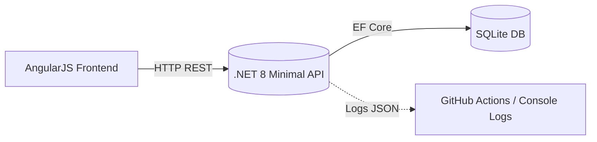

# 🧩 Legacy Dashboard — .NET 8 Minimal API + AngularJS 1.x + SQLite

**Goal:** Simulate a legacy modernization scenario with a clean, testable, containerized stack.

---

## 🚀 Stack

| Layer | Technology | Description |
|-------|-------------|-------------|
| Backend | ASP.NET Core Minimal API (.NET 8), EF Core (SQLite), xUnit | CRUD + pagination, SQLite local DB |
| Frontend | AngularJS 1.x (controller + service), Karma/Jasmine | Simple UI with one smoke test |
| DevOps | Docker (multi-stage), docker-compose.yml, GitHub Actions | Build, test, and run in isolated environments |

---

## ⚙️ Run Locally (no Docker)

### Backend
```bash
cd src/Backend.Api
dotnet restore
dotnet ef database update
dotnet run
# → API on http://localhost:5080 (configured via launchSettings.json)
```

### Frontend
```bash
cd src/Frontend.AngularJS
npm install
npm run dev
# → Frontend on http://localhost:5173
```

---

## 🐳 Run with Docker

```bash
docker compose up --build
# Frontend → http://localhost:8080
# API      → http://localhost:5080
```

Both containers communicate through the internal Docker network (`api` and `web`).

---

## 📡 API Endpoints

| Method | Endpoint | Description |
|---------|-----------|-------------|
| `GET` | `/api/items?page=1&pageSize=10` | Paginated list — returns `{ items, totalCount, page, pageSize }` |
| `POST` | `/api/items` | Create new item |
| `PUT` | `/api/items/{id}` | Update item |
| `DELETE` | `/api/items/{id}` | Delete item |
| `GET` | `/health` | Health check endpoint |

---

## 🧪 Tests

### Backend (.NET)
```bash
dotnet test
```

### Frontend (AngularJS)
```bash
npx karma start karma.conf.cjs --single-run --browsers ChromeHeadless
```

Both test suites are minimal, focused on validating key integration and initialization.

---

## 🏗️ Architecture Diagram



---

## 🧠 Design Decisions

- **Minimal API** for low boilerplate and performance.  
- **SQLite** chosen to avoid external DB setup and simplify portability.  
- **Pagination server-side** to prevent overload and simulate production patterns.  
- **Docker multi-stage** for smaller, secure images separating build and runtime.  
- **CI/CD** pipeline ensures build + test on every push/PR.  
- **CORS policy** restricted to `localhost:5173` for local dev.

---

## 🧾 CI Status


---

## 🪪 License

MIT — 2025 © Francisco Cordero Aguero
