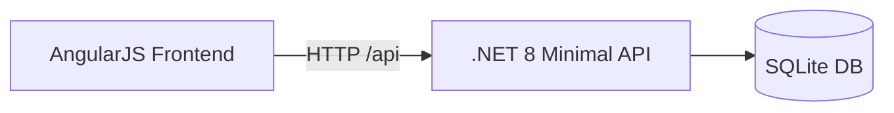

# Legacy Dashboard — .NET 8 Minimal API + AngularJS 1.x + SQLite

**Goal:** Simulate a legacy modernization scenario with a clean, testable, containerized stack.



## Stack
- **Backend:** ASP.NET Core Minimal API (.NET 8), EF Core (SQLite), xUnit tests
- **Frontend:** AngularJS 1.x (controller + service), Karma/Jasmine (1 basic test)
- **DevOps:** Dockerfiles (multi-stage for API), `docker-compose.yml`, GitHub Actions (build & test)

## Run (Local, no Docker)
### Backend
```bash
cd src/Backend.Api
dotnet restore
dotnet ef database update
dotnet run
# API on http://localhost:5080 (configured via launchSettings.json)
```

### Frontend
```bash
cd src/Frontend.AngularJS
npm install
npm run dev
# Frontend on http://localhost:5173
```

## Run with Docker
```bash
docker compose up --build
# Frontend: http://localhost:8080
# API:      http://localhost:5080
```

## API Endpoints (excerpt)
- `GET /api/items?page=1&pageSize=10` — returns `{ items, totalCount, page, pageSize }`
- `POST /api/items` — create
- `PUT /api/items/{id}` — update
- `DELETE /api/items/{id}` — delete

## Design Decisions
- **Minimal API** for low boilerplate and clarity.
- **SQLite** to avoid external DB infra in demo; EF Core migrations included.
- **Pagination** server-side to protect resources and enable scale.
- **Docker multi-stage** to shrink runtime image and separate build toolchain.
- **CI** to enforce build + test pass on every push/PR.